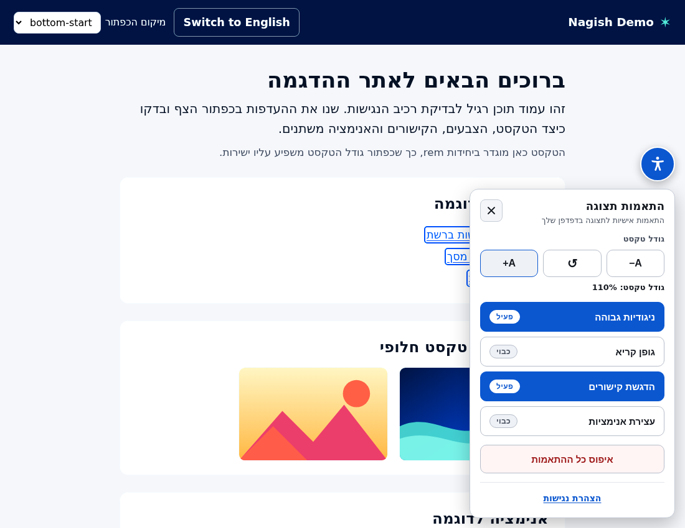
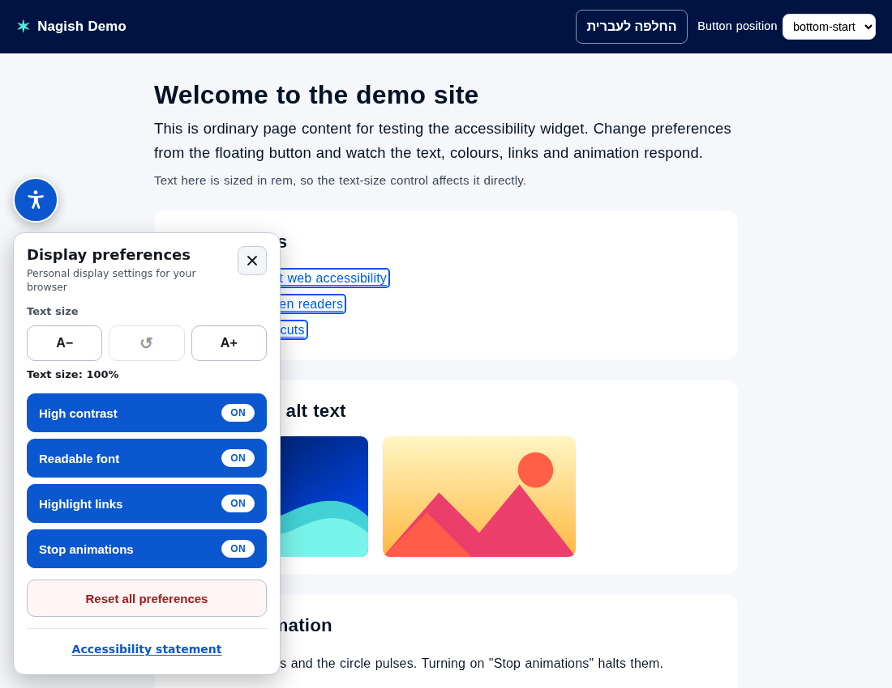

# Accessibility Widget (React · RTL-first · Next.js)

A floating button that opens a panel of **user-controlled display preferences**
— text size, high contrast, a readable font, link highlighting, and a stop-
animations switch — built RTL-first (Hebrew default, English/LTR supported).

> This is a **user-preference tool**, not an "accessibility overlay". It does
> **not** auto-fix markup, inject ARIA/alt text, or make any
> compliance/standards/legal claim. It simply applies the visitor's chosen
> display preferences in their own browser, persisted per-origin.

The widget's own UI is built to be flawlessly accessible: a real `<button>`
trigger with full ARIA state, a focus-trapped `role="dialog"` (Esc closes, focus
returns to the trigger), real `<button>` controls with `aria-pressed`, visible
high-contrast focus rings, logical-property RTL/LTR mirroring, and respect for
`prefers-reduced-motion`.

|                         Hebrew / RTL                          |                       English / LTR                        |
| :----------------------------------------------------------: | :--------------------------------------------------------: |
|  |  |

## Run it locally

```bash
npm install
npm run dev      # http://localhost:3000  — demo host page with the widget
```

Other scripts:

```bash
npm run build      # production build (also type-checks)
npm run start      # serve the production build
npm run typecheck  # tsc --noEmit
```

### Optional: run the accessibility behaviour tests

`scripts/verify.mjs` drives a real browser to assert the hard parts (focus
trap, ARIA state, each control's effect on `<html>`, persistence, RTL mirroring).

```bash
npm run build && npm run start &      # serve on :3000, or use port 3210
npm i -D playwright && npx playwright install chromium
node scripts/verify.mjs               # expects the app on http://localhost:3210
```

(The script's `BASE` URL is at the top — point it at wherever you're serving.)

## Files

| File | Purpose |
| --- | --- |
| `components/AccessibilityWidget/AccessibilityWidget.tsx` | The component. Ships its own **scoped** styles (injected `<style>`, all under `.a11y-widget-root`). |
| `components/AccessibilityWidget/a11y-widget-host.css` | **Host-page** stylesheet. Turns the classes/var the widget toggles into actual visual effects. Import once, globally. |
| `components/AccessibilityWidget/i18n.ts` | All UI strings (`he` + `en`), typed; easy to extend. |
| `app/layout.tsx`, `app/page.tsx`, `app/globals.css` | Minimal app-router demo: a form, images, links, and a CSS animation so you can confirm every control does something. |
| `public/sample-1.svg`, `public/sample-2.svg` | Local demo images (no network calls). |
| `scripts/verify.mjs` | Optional Playwright behaviour tests. |

## Using it in your own site

```tsx
// app/layout.tsx (host site) — import the host stylesheet ONCE, globally:
import "@/components/AccessibilityWidget/a11y-widget-host.css";
```

```tsx
// anywhere in your app (it's a client component):
import AccessibilityWidget from "@/components/AccessibilityWidget/AccessibilityWidget";

export default function Page() {
  return (
    <>
      {/* ...your content... */}
      <AccessibilityWidget
        lang="he"                       // "he" (default) | "en"
        position="bottom-start"         // bottom-start | bottom-end | top-start | top-end
        statementUrl="/accessibility"   // OR pass onStatementClick instead
      />
    </>
  );
}
```

### Props

| Prop | Type | Default | Notes |
| --- | --- | --- | --- |
| `lang` | `"he" \| "en"` | `"he"` | UI language **and** the widget's base direction (`he`→rtl, `en`→ltr). |
| `position` | `"bottom-start" \| "bottom-end" \| "top-start" \| "top-end"` | `"bottom-start"` | Corner for the floating button (logical → mirrors with direction). |
| `statementUrl` | `string` | — | If set, renders the statement link (opens in a new tab). |
| `onStatementClick` | `() => void` | — | Alternative to `statementUrl`; renders the statement as a button. |

Preferences persist to `localStorage` under `a11y-widget:v1`, per-origin, restored
on mount. (No cross-domain sync — that's intentional.)

### How effects apply

The widget only ever toggles state on `document.documentElement` (`<html>`):

| Hook on `<html>` | Set by control |
| --- | --- |
| `--a11y-font-scale` (custom property) | Text size |
| `.a11y-high-contrast` | High contrast |
| `.a11y-readable-font` | Readable font |
| `.a11y-highlight-links` | Highlight links |
| `.a11y-stop-animations` | Stop animations |

It never touches individual host elements. The **visual meaning** of those hooks
lives entirely in `a11y-widget-host.css` — that's the contract.

---

## Summary

### (a) Judgment calls

1. **Client-only mount (no SSR markup for the widget).** The component renders
   `null` until mounted, then portals into `document.body`. This guarantees no
   hydration mismatch and lets the floating UI escape any transformed/clipped
   host container. Trade-off: there's no server-rendered/no-JS trigger button —
   acceptable, since focus-trapping and the portal are inherently client-side.

2. **High contrast is filtered per top-level `<body>` child, not on `<html>`.**
   A CSS `filter` on an ancestor of a `position: fixed` element makes that
   ancestor the containing block and **breaks fixed positioning** — the floating
   button would scroll away. So the host rule is
   `html.a11y-high-contrast body > *:not(.a11y-widget-root) { filter: … }`,
   which boosts all real content while leaving the widget pinned. (Verified:
   "trigger stays pinned in viewport under high-contrast".) Minor caveat: each
   top-level child becomes its own filter context — visually identical to a
   whole-page filter for contrast/saturate in practice.

3. **The widget's own chrome is sized in `px`, not `rem`.** The text-size control
   scales the host page (root `font-size`), but the panel itself stays a stable,
   predictable size. Intentional: the control is for *your content*, and a
   control panel that resizes itself while you use it is worse UX.

4. **Style isolation via `all: initial` + a single scoped root class** (plain
   React + scoped stylesheet, as required — no Shadow DOM, no Tailwind, no deps).
   `all: initial` on `.a11y-widget-root` blocks inherited host styles; everything
   is re-declared from scratch under that scope. Known limitation: a host rule
   that *directly* targets descendants with `!important`
   (e.g. `body button { … !important }`) can still reach in. Full immunity would
   need Shadow DOM, which was out of scope for a drop-in stylesheet.

5. **Font scaling = scale the root `font-size`** (so `rem`/`em` content scales),
   rather than mutating elements. Works best when host body text is sized in
   `rem`/`em`; text hard-pinned in `px` won't scale. That's the standard
   trade-off of a non-invasive approach that never touches host elements.

6. **Entrance animation only.** The panel animates in (gated by
   `prefers-reduced-motion`) and unmounts immediately on close, so focus return
   to the trigger is synchronous and never races an exit animation.

7. **Readable font ships a system stack**, preferring `Atkinson Hyperlegible` /
   `OpenDyslexic` when the user has them installed, then falling back through
   widely-available legible sans faces (including Hebrew-capable Arial/Tahoma).
   No webfont is fetched at runtime (per spec), so the exact face depends on
   what's installed locally.

8. **Demo-only:** switching language flips the whole document's `lang`/`dir` so
   the sample content mirrors too. In production the host owns its own direction;
   the widget's direction is independent via the `lang` prop.

### (b) Which controls need the host stylesheet vs. work standalone

**The entire widget UI works standalone** — the floating button, the panel, the
focus trap, keyboard handling, ARIA, persistence, and the scoped styling all ship
inside the component and need nothing else.

But the controls produce **no visible effect on the page** without
`a11y-widget-host.css`, because the widget deliberately only flips switches on
`<html>` — the host stylesheet is what makes them mean something:

| Control | Needs `a11y-widget-host.css`? |
| --- | --- |
| **Text size** (font scale) | **Yes** — host rule scales root `font-size` from `--a11y-font-scale`. |
| **High contrast** | **Yes** — host rule applies the `filter`. |
| **Readable font** | **Yes** — host rule sets the legible font stack. |
| **Highlight links** | **Yes** — host rule underlines/outlines links. |
| **Stop animations** | **Yes** — host rule neutralises animations/transitions. |
| **Reset all** | Standalone — clears classes/var/localStorage (its *visible* result is just the above being un-applied). |
| **Statement link** | Standalone — it's just a link/button. |

In short: **all five display-effect controls require the host stylesheet; the
widget chrome, Reset-all, and the statement link do not.**
